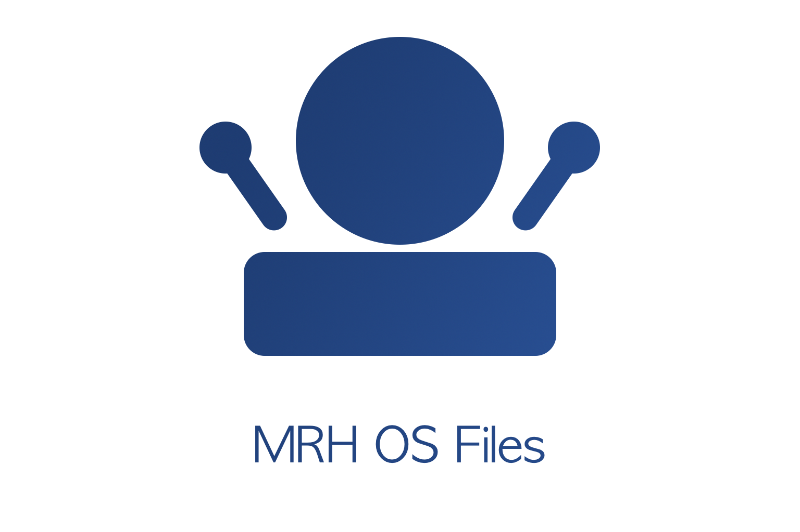

mrh_os_files
============

   
The mrh_os_files project supplies default files used by the MRH platform. 
All files are organized in a way which matches the expected structure defined 
by the individual components when using their default settings.

.. toctree::
   :maxdepth: 2
   :caption: Contents:

   opt_mrh/opt_mrh
   var_log_mrh/var_log_mrh
   var_mrh/var_mrh
   usr_local_etc_mrh/usr_local_etc_mrh
   usr_local_etc_mrh_mrhpservice/usr_local_etc_mrh_mrhpservice
